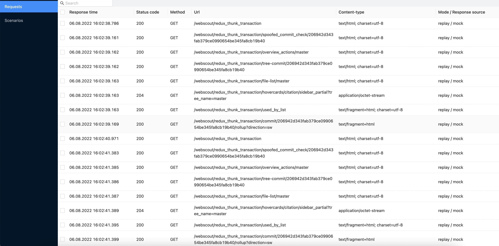

# Koa mock proxy

`koa-mock-proxy` is a tool for creating proxy servers with possibility of record and replay responses (mocks).

It can be useful for:
 * service/integration tests (for example, when you want test only frontend)
 * e2e tests where you want to isolate only chosen endpoints
 * Manually testing application without backend or for a specific scenario that difficult to reproduce
 * Logging activity between services

You are free to use all possibilities of Koa (custom middlewares like [koa-router](https://www.npmjs.com/package/koa-router)).

## Features
 * Proxy http requests
 * Record requests and responses (body and headers) into human-readable files
 * Log proxy requests, view it using UI
 * Manage different test scenarios (depending on a scenario, same endpoint can return different responses).

## Main advantages

 * Public API made in very familiar way for many JS developers (by applying middlewares)
 * Recorded mocks suitable to put to version control system, easy to understand and update
 * Composability with other libraries and custom mocks code
 * UI for easier debugging and record mocks

## Installation

TODO: update this description after publishing in public repo

Install using npm:

```npm i @detmir/koa-mock-proxy```

Also, it's necessary to install koa, if you don't have it in your project:

```npm i koa```

## [API reference](./docs/api.md)

## [Mocks format and location](./docs/mocks.md)

## [Mocks scenarios](./docs/scenarios.md)

## Working modes

Server can work in the following modes:

1. `record`. Server proxy requests to the `targetUrl` and save responses to file.
2. `replay`. Server read response from file. If there are no matching file, 404 error.
3. `replayOrProxy`. Server read response from file. If there are no matching file, go to `targetUrl`.
4. `proxy`. Server just proxy to the `targetUrl`

Mode is determined by:
1. `mode` param to mockProxy middleware
2. Using middleware `mockProxyConfig` (must be defined before `mockProxy` middleware)
3. Using environment variable `KOA_MOCK_PROXY_MODE`

## Examples

The simplest implementation (proxy and record all requests):

```js
import Koa from 'koa';
import { mockProxyMiddleware } from '@detmir/koa-mock-proxy';

const server = new Koa();

server.use(mockProxyMiddleware({
  mocksDirectory: './mocks/',
  targetUrl: 'http://my-service.com/api'
}));

server.listen(9000);

```

Proxy only a specific route:

```js
  import Koa from 'koa';
  import Router from '@koa/router';
  import { mockProxy, mockProxyConfig } from 'koa-mock-proxy';

  const server = new Koa();
  server.use(mockProxyConfig({
    targetUrl: 'http://my-service.com/api'
  }))

  const userRouter = new Router();
  // This route will record or replay depending on global configuration
  userRouter.post('/users', mockProxy());

  // This route will replay or proxy
  userRouter.post('/users', mockProxy({ mode: 'replayOrProxy' }));

  // this route proxy to custom url
  userRouter.get('/user/:id', mockProxy({
    mode: 'record',
    targetUrl: 'http://my-service2.com/api'
  }));

  server.use(userRouter.routes());

  server.use(koaMockProxy({
    targetUrl: 'http://my-service.com/api'
  }));

  server.listen(9000);
```

More complex examples are available [here](./examples/).

## Debugging

You can set env variable `DEBUG_PROXY=true` if you want to see in console all requests coming through mock server.

## UI



In UI you can:
 * Explore requests log and response source (mock vs proxy)
 * Set active scenarios
 * Record selected requests to mock file (WIP)

For using UI you need to apply [controlMiddleware](./docs/api.md):

``
server.use(controlMiddleware({ path: '/mockproxy' }));
``

After applying, UI will be available at the path `/mockproxy`.
